# Hi there 👋 I'm pashutaz

A passionate full-stack developer with diverse experience across multiple technologies and platforms. I love building web applications, games, and innovative solutions.

## 💻 Tech Stack

**Backend & Frameworks:**
- PHP & Laravel
- Node.js
- Apache Kafka integration

**Frontend & UI:**
- Vue.js & Nuxt.js
- HTML/CSS/JavaScript
- Vue-based dashboards

**Other:**
- REST APIs
- Database design
- CI/CD practices

## 📚 Featured Projects

### Web Applications
- **[laravel-vue-bookings](https://github.com/pashutaz/laravel-vue-bookings)** - Booking system built with Laravel and Vue
- **[laravel-blog](https://github.com/pashutaz/laravel-blog)** - Simple blog platform using Laravel
- **[nuxt-shop](https://github.com/pashutaz/nuxt-shop)** - E-commerce shop built with Nuxt.js and Vue
- **[Vuexy](https://github.com/pashutaz/Vuexy)** - Vue.js dashboard/admin template

### Tools & Services
- **[kafka-service](https://github.com/pashutaz/kafka-service)** - PHP package for Apache Kafka integration
- **[contact-form](https://github.com/pashutaz/contact-form)** - Website feedback contact form
- **[Laradash](https://github.com/pashutaz/Laradash)** - Laravel dashboard utility
- **[code-player](https://github.com/pashutaz/code-player)** - Web app for sharing and playing code

### Utility & Other
- **[Enote](https://github.com/pashutaz/Enote)** - Personal note-taking site
- **[TerminalPersonalPage](https://github.com/pashutaz/TerminalPersonalPage)** - Terminal-style personal page
- **[hotsmaster](https://github.com/pashutaz/hotsmaster)** - Heroes of the Storm fan site
- **[app-landing-page](https://github.com/pashutaz/app-landing-page)** - App landing page template
- **[honey](https://github.com/pashutaz/honey)** - Money exchanger template

## 💡 What I'm Working With

- Building scalable web applications with Laravel and modern JavaScript frameworks
- Integrating message queues (Apache Kafka) for distributed systems
- Creating responsive, interactive UIs with Vue.js and Nuxt

## 🤝 Let's Collaborate

I'm interested in working on:
- Full-stack web applications
- API development and integration
- Interactive web experiences
- Mobile app projects

## 📫 Get In Touch

Feel free to explore my repositories and reach out if you'd like to collaborate or discuss any projects!

---

### 📊 My GitHub Stats

